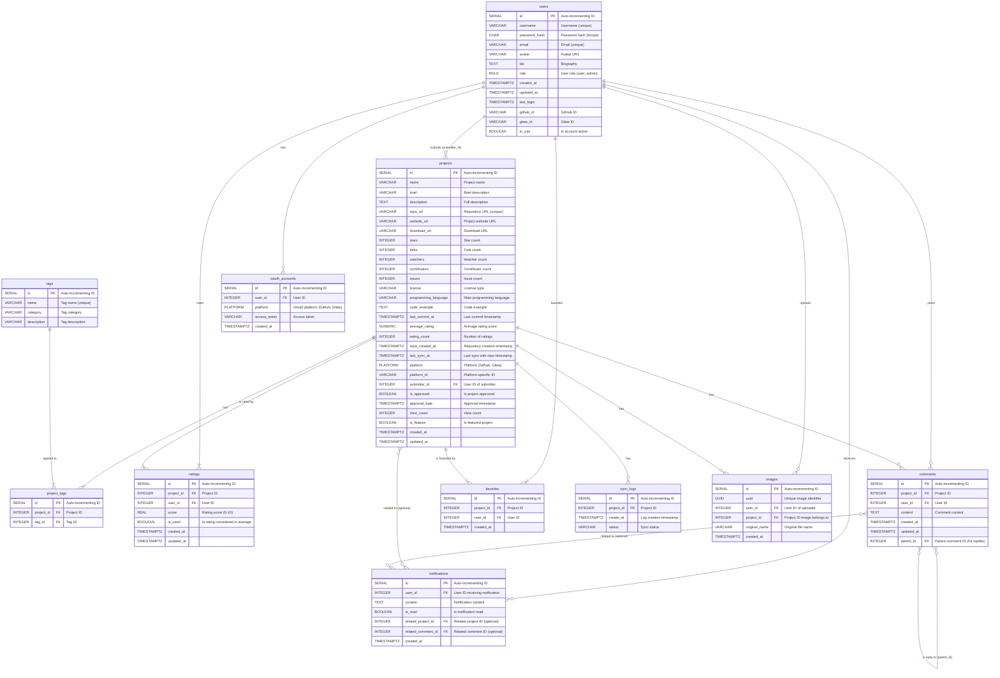

```json
{
  "settings": {
    "analysis": {
      "analyzer": {
        "ik_max_pinyin": {
          "tokenizer": "ik_max_word",
          "filter": "my_pinyin"
        }
      },
      "filter": {
        "my_pinyin": {
          "type": "pinyin",
          "keep_full_pinyin": false,
          "keep_joined_full_pinyin": true,
          "keep_original": true,
          "limit_first_letter_length": 16,
          "remove_duplicated_term": true,
          "none_chinese_pinyin_tokenize": false
        }
      }
    }
  },
  "mappings": {
    "properties": {
      "name": {
        "type": "text",
        "analyzer": "ik_max_pinyin",
        "search_analyzer": "ik_smart",
        "fields": {
          "suggest": {
            "type": "completion",
            "analyzer": "keyword",
            "search_analyzer": "keyword"
          }
        }
      },
      "brief": {
        "type": "text",
        "analyzer": "ik_max_pinyin",
        "search_analyzer": "ik_smart",
      },
      "description": {
        "type": "text",
        "analyzer": "ik_max_pinyin",
        "search_analyzer": "ik_smart",
      },
      "programming_language": {
        "type": "keyword"
      },
      "license": {
        "type": "keyword"
      },
      "platform": {
        "type": "keyword"
      },
      "is_featured": {
        "type": "boolean"
      },
      "tags": {
        "type": "integer"
      }
    }
  }
}
```

```json
{
  "query": {
    "bool": {
      "filter": [
        {
          "terms_set": {
            "tags": {
              "terms": [
                1,
                2,
                3
              ],
              "minimum_should_match": 1
            }
          }
        }
      ],
      "must": [
        {
          "multi_match": {
            "query": "pt",
            "fields": [
              "name^5",
              "brief^3",
              "description^1"
            ]
          }
        }
      ]
    }
  },
  "from": 0,
  "size": 10,
  "_source": false
}
```